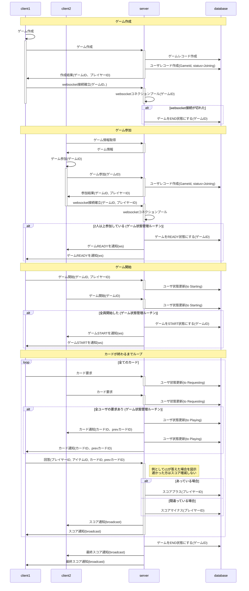
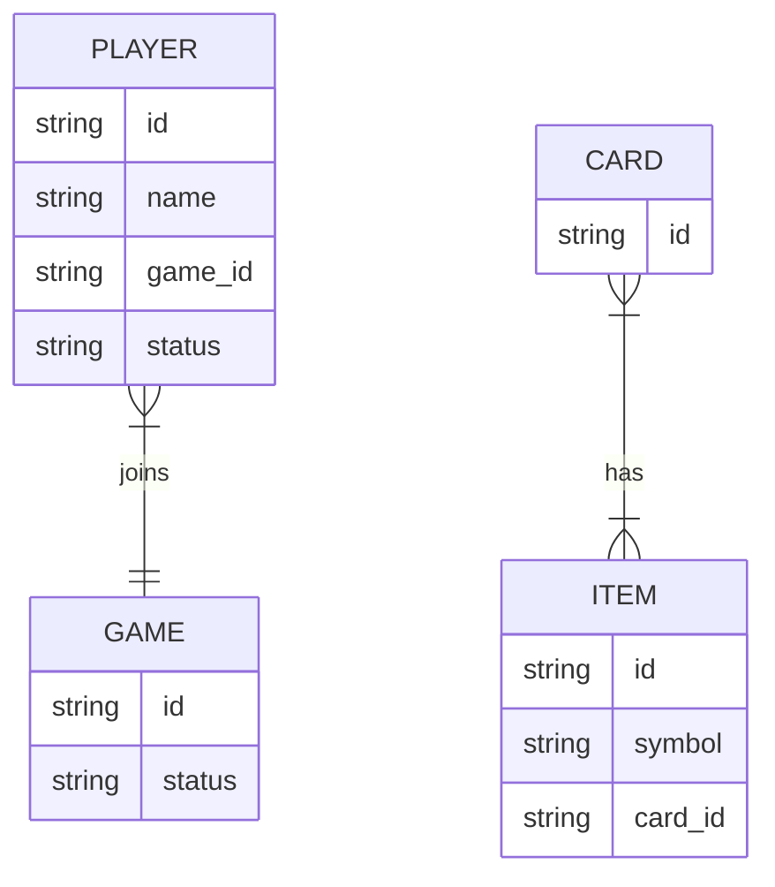

# Gobble: Dobble風webゲーム

本サービスは勉強のため個人で作成したものです。
楽しかったらぜひ本家[Dobble](https://hobbyjapan.games/dobble/)をお買い上げください。
(物理のほうが面白いよ！)

## 🎯 概要

- gRPCの学習に適したシンプルで実用的なサービスを開発
- Dobbleのルールを活かし、リアルタイム通信・マッチング・状態同期をgRPCで実装
- サーバー・クライアントの構造を理解する

---

## 🧩 Dobble の基本ルール（おさらい）

- 各カードに複数のシンボルがある
- 任意の2枚のカードには**必ず1つだけ共通するシンボル**がある
- 共通シンボルを見つけて他プレイヤーより先に叫ぶゲーム

---

## 🏗 システム構成


✅ 構成のポイント整理

🔷 1. gRPCサーバー
- 状態管理（ゲームの作成・参加・マッチ処理など）を担当
- Remix または Connect 経由で呼び出される
- WebSocket通知のトリガーもここから送る

🔶 2. coder/websocket
- WebSocket通知専用の軽量サーバー
- gRPCから「状態変化イベント」を受け取り
- ユーザーへリアルタイムpush（勝敗・スコア・カード更新など）

🌀 3. Remix + Connect
- フロントエンド（Reactベース）
- Connect（クライアントライブラリ）を使って gRPCサーバーと通信
- WebSocketも直接接続してリアルタイムイベントを受信

🧍 4. ユーザー
- ブラウザから Remix を通じて参加
- Connect（gRPC-JSON）で状態取得・操作
- WebSocketで通知を受信
---

## 🧪 gRPC サービス定義（概要）

### GobbleService

```protobuf
service GobbleService {
  rpc JoinGame(JoinRequest) returns (JoinResponse);
  rpc GetGameState(GameStateRequest) returns (GameStateResponse);
  rpc StreamGameState(GameStreamRequest) returns (stream GameStateUpdate);
  rpc MatchSymbol(MatchRequest) returns (MatchResponse);
  rpc LeaveGame(LeaveRequest) returns (LeaveResponse);
}
```

---

## 📦 メッセージ定義（例）

```protobuf
message JoinRequest {
  string player_name = 1;
}

message JoinResponse {
  string player_id = 1;
  string game_id = 2;
}

message GameStateRequest {
  string game_id = 1;
}

message GameStateResponse {
  repeated Card cards = 1;
  string current_turn_player = 2;
}

message MatchRequest {
  string player_id = 1;
  string game_id = 2;
  string symbol = 3;
}

message MatchResponse {
  bool correct = 1;
  string message = 2;
}

message Card {
  string card_id = 1;
  repeated string symbols = 2;
}
```

---

## ⚙️ 機能一覧

| 機能名         | 内容                                                        |
|----------------|-------------------------------------------------------------|
| プレイヤー登録 | 名前を登録してゲームに参加                                  |
| ゲーム開始     | プレイヤーが2人以上になると開始                             |
| カード配布     | 各プレイヤーと場にカードを配布（共通シンボルを持たせる）   |
| シンボル選択   | プレイヤーが共通だと思うシンボルを選んで送信               |
| 判定           | サーバーが正誤を判定、成功したらカードを更新               |
| 状態配信       | サーバーがすべてのクライアントに状態を配信（stream）       |
| ゲーム終了     | カードが尽きた時点で終了、結果を配信                        |

---

## 🧠 学習ポイント

- Unary RPC vs. Streaming RPC
- gRPCによる双方向通信
- 状態管理とセッション設計
- gRPCurl や CLIツールによるテスト
- .protoファイル設計とIDLベースの開発フロー

---

## 📈 実装ステップ案

1. `JoinGame` と `GetGameState` を作って接続テスト
2. カード生成ロジック（数学的にユニークなDobbleカード）
3. `MatchSymbol` → 判定ロジックの実装
4. streamで状態を配信
5. テストクライアント or gRPCurlで検証
6. UI追加（必要なら）

---

## 📝 補足

- 「Gobble」は「gRPC + Dobble」に敬意を表した名前

---


## ✅ TODOリスト


### 🚀 初期動作確認ステップ

- [ ] Goのインストール（推奨: Go 1.21以降）
- [ ] Node.js & npm/yarnのインストール（推奨: Node 18+）
- [ ] `protoc` のインストール + プラグイン（`protoc-gen-go`, `protoc-gen-connect-go`, `protoc-gen-connect-web`）
- [ ] `buf` CLI の導入と初期化（`buf.yaml`, `buf.gen.yaml` の作成）
- [ ] `.proto` ファイルに `Hello` サービスを定義（`HelloRequest`, `HelloResponse`）
- [ ] Goで `Hello` を返す最小の Connect gRPCサーバーを実装
- [ ] Goサーバーをローカルで起動（例：`:8080`）
- [ ] `buf generate` で TypeScript クライアントコードを生成
- [ ] Remix プロジェクト内で `Connect` クライアントを設定
- [ ] Remix の Loader で `hello()` を呼び、ブラウザで文字列を表示

### 🎮 ゲーム機能（gRPC）

- [ ] `JoinGame` 実装：プレイヤーが参加できるようにする
- [ ] `GetGameState` 実装：現在のゲーム状態を取得
- [ ] `MatchSymbol` 実装：シンボルが一致しているか判定
- [ ] `StreamGameState` 実装：クライアントに状態を配信（stream）
- [ ] `LeaveGame` 実装：プレイヤーの離脱処理
- [ ] `GameManager` 設計：ゲーム状態の保持と管理

### 🧩 ゲームロジック

- [ ] Dobbleカードの組み合わせロジックを実装
- [ ] プレイヤーと場へのカード配布処理
- [ ] スコア管理とゲーム終了判定の実装

### 🌀 通信処理

- [ ] gRPC サーバーの起動とルーティング整理
- [ ] WebSocketサーバー実装（`nhooyr/websocket` 推奨）
- [ ] gRPC→WebSocketへのイベント連携処理
- [ ] WebSocket接続のプレイヤー識別・ルーム分離処理

### 🖥 クライアント（Remix）

- [ ] Connectクライアントの実装とエラーハンドリング
- [ ] WebSocketクライアント接続・購読処理
- [ ] UIでの状態表示（カード・プレイヤー名など）
- [ ] ユーザー操作に対応するリクエスト発行（Join/Match）

### 🧪 開発補助

- [ ] gRPCurl または grpcui での手動確認
- [ ] テスト用プレイヤーデータの生成スクリプト
- [ ] .protoファイルの検証と更新管理

### 📘 ドキュメント改善

- [ ] ConnectとgRPCの関係を構成図に明示（矢印の方向など）
- [ ] WebSocket通知の流れ・契機を追記
- [ ] 構成全体を簡潔に解説した図の追加

# シーケンス


ユーザの状態
- Joining
- Starting
- Requesting
- Playing

ゲームの状態
- CREATED
- READY
- STARTED
- FINISHED
- ABORTED

### 🎨 ER図（概略）
GAMEを実施する時にCARDセットを取得。ランダムにCARDを消費しながら全てのCARDに対して処理をする。


